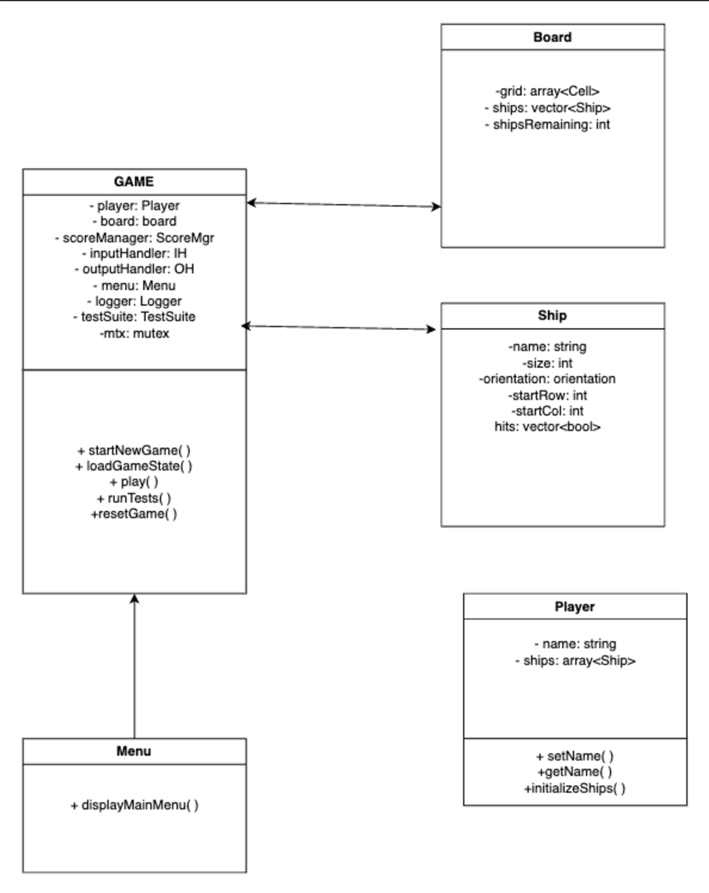

# **Battleship Game**

Welcome to the **Battleship Game**, a console-based implementation of the classic board game. The game supports creating a new game, saving/loading game states, viewing high scores, and running unit tests.

---

## 📋 **Table of Contents**

1. [Introduction](#introduction)  
2. [Features](#features)  
3. [Setup Instructions](#setup-instructions)  
4. [Gameplay Instructions](#gameplay-instructions)  
5. [Class Documentation](#class-documentation)  
6. [UML Diagram](#uml-diagram)  
7. [Contributors](#contributors)  
8. [License](#license)  

---

## **Introduction**

This project is a **C++ implementation** of the classic **Battleship** game. The game allows players to place ships, attack positions, and try to sink all enemy ships. It includes features such as saving and loading game states, displaying high scores, and running automated tests.

---

## 🌟 **Features**

- **Start New Game**: Begin a fresh game session.  
- **Save and Load**: Save your progress and load it later.  
- **High Scores**: Keep track of top scores.  
- **Reset Game**: Reset the game to its initial state.  
- **Testing Suite**: Run unit tests to validate game logic.  
- **Autosave**: Game automatically saves every 60 seconds during play.  

---

## 🛠️ **Setup Instructions**

1. **Clone the Repository**:

    ```bash
    git clone https://github.com/yourusername/battleship.git
    cd battleship
    ```

2. **Build the Project**:

    ```bash
    make
    ```

3. **Run the Game**:

    ```bash
    ./dist/Debug/GNU-MacOSX/battleship
    ```

4. **Clean the Build**:

    ```bash
    make clean
    ```

---

## 🎮 **Gameplay Instructions**

1. **Starting the Game**:

    ```plaintext
    ========================================
                  Battleship               
    ========================================
    1. Start New Game
    2. Load Game
    3. View High Scores
    4. Reset Game
    5. Run Tests
    6. Exit
    Choose an option: _
    ```

2. **Attacking**:

    Enter coordinates like `A5` to attack positions on the board.

3. **Winning the Game**:

    Sink all enemy ships to win the game.

---

## 🧾 **Class Documentation**

### 1. **Game Class**

**File**: `game.h` / `game.cpp`

```cpp
class Game {
public:
    Game();
    ~Game();

    void startNewGame();
    void loadGameState();
    void play();
    void runTests();
    void resetGame();
    void run();

private:
    Player player;
    Board board;
    ScoreManager scoreManager;
    SaveLoadManager saveLoadManager;
    InputHandler inputHandler;
    OutputHandler outputHandler;
    Menu menu;
    Logger logger;
    TestSuite testSuite;
    bool exitGame;
    std::mutex mtx;
    static int gameCount;
};
```
---

## Player Class

```cpp
class Player {
public:
    Player();
    Player(const std::string& name);
    Player(const Player& other);
    ~Player();

    Player& operator=(const Player& other);
    bool operator==(const Player& other) const;

    void setName(const std::string& name);
    std::string getName() const;
    void initializeShips();
    std::array<Ship, MAX_SHIPS>& getShips();
    const std::array<Ship, MAX_SHIPS>& getShips() const;

private:
    std::string name;
    std::array<Ship, MAX_SHIPS> ships;
};

---

```
## Ship Class

```cpp
class Ship : public GameEntity {
public:
    Ship();
    Ship(const std::string& name, int size);
    Ship(const Ship& other);

    std::string getName() const override;
    int getSize() const;
    Orientation getOrientation() const;
    int getStartRow() const;
    int getStartCol() const;
    std::vector<bool> getHits() const;

    void setPosition(int row, int col, Orientation orient);
    void setHits(const std::vector<bool>& newHits);
    bool coversCell(int row, int col) const;
    bool hitCell(int row, int col);
    bool isSunk() const;

    void display() const override;
    bool operator==(const Ship& other) const;

private:
    std::string name;
    int size;
    Orientation orientation;
    int startRow;
    int startCol;
    std::vector<bool> hits;
};

---

```
## Board Class
```cpp
class Board {
public:
    Board();
    Board(const Board& other);
    ~Board();

    Board& operator=(const Board& other);
    bool operator==(const Board& other) const;

    void initializeGrid();
    void placeAllShips();
    bool placeShip(int shipIndex, int row, int col, Orientation orientation);
    bool attack(int row, int col);
    bool allShipsSunk() const;
    void displayGrid(bool showShips) const;
    std::array<std::array<Cell, BOARD_SIZE>, BOARD_SIZE> getGrid() const;
    void loadGrid(const std::array<std::array<Cell, BOARD_SIZE>, BOARD_SIZE>& loadedGrid);

private:
    std::array<std::array<Cell, BOARD_SIZE>, BOARD_SIZE> grid;
    std::vector<Ship> ships;
    int shipsRemaining;
    std::mutex mtx;
};
```

---

## Menu Class

```cpp
class Menu {
public:
    Menu();
    Menu(const Menu& other);
    ~Menu();

    Menu& operator=(const Menu& other);
    bool operator==(const Menu& other) const;

    int displayMainMenu() const;
};
```
---

## UML Diagram



